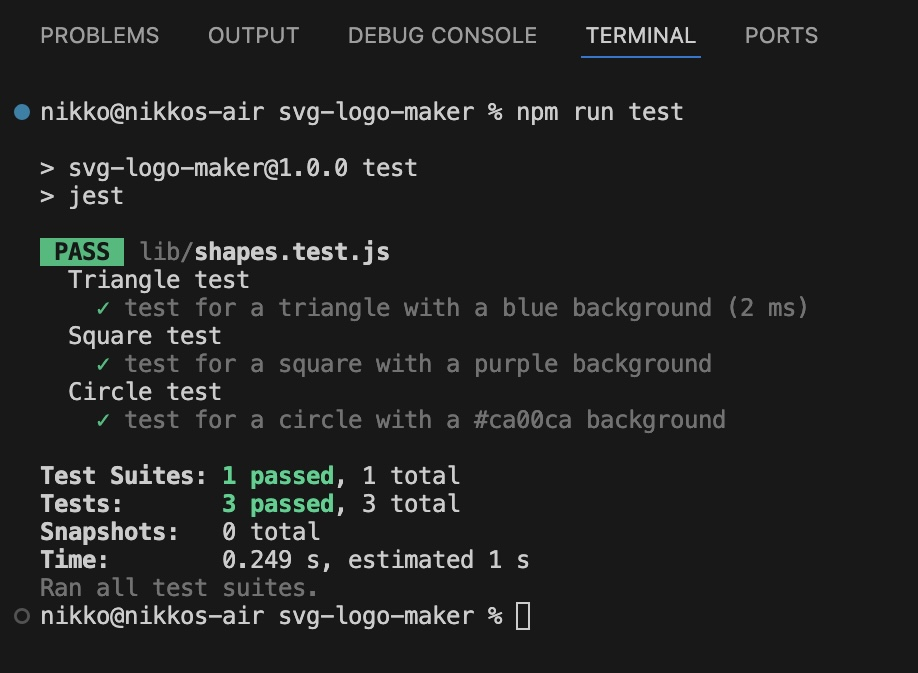

# SVG-Logo-Maker

## Description
  This is a command-line application that can create simple logos.

## Table of Contents
- [Installation](#installation)
- [Usage](#usage)
- [Credits](#credits)
- [License](#license)
- [Tests](#tests)
- [Questions](#questions)

## Installation
- Node.js must be installed
- Using the command line, install inquirer with the following command: npm i inquirer@8.2.4
- Using the command line, install jest with the following command: npm i jest
- Now you can run the application with the following command: node index.js

## Usage
[Walkthrough Video](https://drive.google.com/file/d/1v72oz8A1O0XfFtnCDvct_Lzg-uzQtTRP/view?usp=sharing)

## Credits
N/A

## License
MIT License

## Tests
How to run unit testing:

(Command line)

- Run command: npm run test

## Questions
If you have any questions regarding this project, contact me via:
- GitHub: [https://github.com/ImNeeeks](https://github.com/ImNeeeks)
- Email: nikkojacinto@gmail.com
